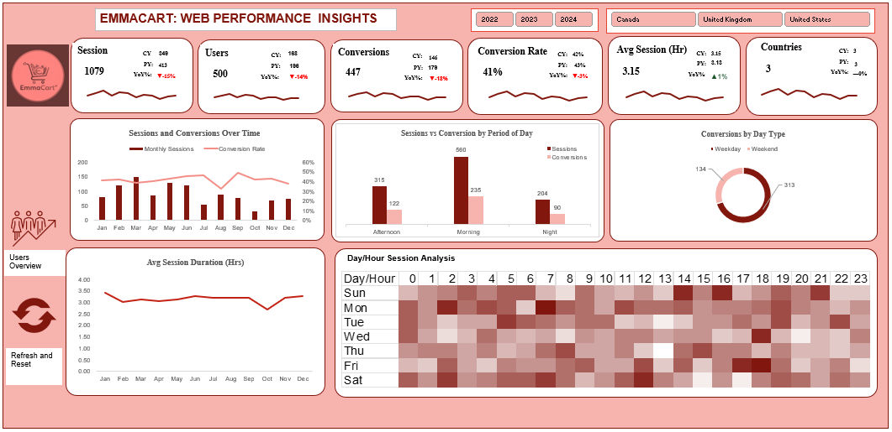
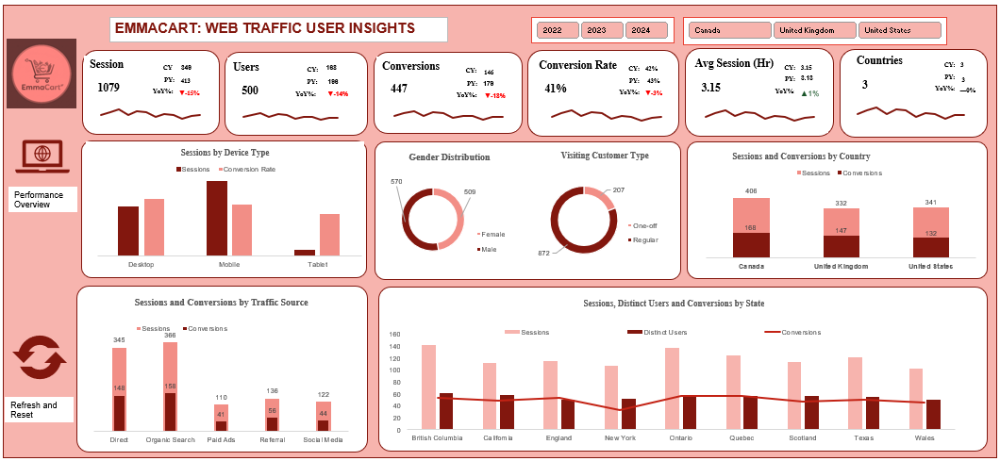

# 📊 EmmaCart — Web Traffic & Performance Analytics 

> A full Microsoft Excel analytics project analysing the web performance of an online retail store across 3 years of operation (2022–2024). **[📁 View Project Files on Google Drive](https://drive.google.com/drive/folders/19MszRvBEV7FZpzhRZ429UMEj8HKqu7oY?usp=sharing)**

---

## 🗂️ Project Overview

EmmaCart is an end-to-end data analytics project built entirely in **Microsoft Excel**
It covers the complete data pipeline from raw data ingestion through to an interactive, macros-driven dashboard with actionable business insights.

The dataset contains **1,079 total sessions** across 2022–2024, enabling year-over-year trend analysis, customer behaviour segmentation, and conversion optimisation.

---

## ⚡ Important — Enable Macros

> The workbook is saved as **`.xlsm` (Excel Macro-Enabled Workbook)**.

The dashboard includes buttons on the right-hand side that are powered by recorded macros. To use them:

1. Open `EmmaCart.xlsm` in Microsoft Excel
2. When prompted by the **Security Warning** banner at the top, click **"Enable Content"**
3. The following macro buttons will be fully functional:
   - **🔄 Refresh** — updates all Pivot Table data sources and refreshes connected charts
   - **↩️ Reset** — clears all active slicer selections and resets the dashboard to its default view
   - **🔀 Switch Dashboard** — navigates between the two dashboards without manual sheet navigation

> ⚠️ If macros are not enabled, the buttons will not respond. The data and charts will still be visible, but interactive navigation and refresh functionality will be disabled.

---

## 📈 Key Metrics

| Metric | Value |
|---|---|
| Total Sessions | 1,079 |
| YoY Sessions Change | –15% |
| YoY Users Change | –14% |
| Overall Conversion Rate | 41% (–3% YoY) |
| Weekend Share of Sessions | 70% |
| Returning Visitors | 76.27% |

---

## 🔍 Key Findings

- **Weekends dominate** — 70% of all sessions and conversions happen on weekends
- **Night converts best** — night visitors achieve the highest conversion rate at 44.11%
- **Sunday 14:00–21:00** is the single highest-engagement window of the week
- **76.27% returning visitors** — heavy reliance on existing customers caps growth
- **Organic Search & Direct** drive the most traffic; Paid Ads underperforms
- **October** is the weakest month three years running — a clear seasonality pattern
- **Sessions and users are declining** YoY — root cause investigation is needed

---

## 💡 Strategic Recommendations

1. **Weekend-First Campaign Strategy** — schedule all promotions from Friday evening through Sunday
2. **Night-Time Retargeting** — send abandoned cart reminders between 21:00 and 23:00
3. **Capitalise on Sunday 14:00–21:00** — assign highest-priority deals to this window
4. **Build a New Customer Acquisition Engine** — invest in Social Media to reduce dependency on returning visitors
5. **Counter the October Slump** — audit competitor activity and test targeted promotions
6. **Reallocate Paid Ads Budget** — redirect spend toward Organic Search and Social Media
7. **Investigate YoY Decline** — cross-reference SEO changes, campaign pauses, and competitor activity

---

Dashboards

## 👤 Author

**Promise Ezeike**
Data Analyst & Consultant @ AMDARI
November 2025

---

## 📄 Documentation

A full project documentation file (`EmmaCart_Documentation.docx`) is included in this repository.
